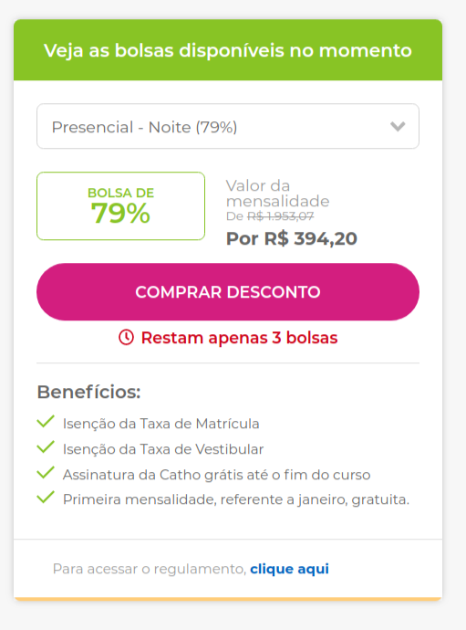

# Frontend Challenge

## Seja bem vindx! 👋

**Para realizar este desafio você precisará de conhecimentos básicos em HTML, CSS e JavaScript.**

## O desafio

Seu desafio será reconstruir um de nossos componentes e deixa-lo o mais próximo do seu design possível.

Você poderá utilizar as ferramentas que se sentir mais confortável para completar o desafio. Se quiser utilizar React melhor ainda.

Seus usuários devem conseguir fazer as ações:

- Ver este componente de maneira otimizada para telas desktop e também mobile
- Expandir a lista de descontos disponíveis, assim como poder selecionar um dos itens da lista e ver o componente com os dados atualizados daquele item  
- Caso o número de itens em estoque for <= 3, um label de senso de urgência deve ser exibido assim como no layout

## Onde encontrar o material

Sua tarefa é construir o componente se baseando nos designs de dentro da pasta `/design`. Você encontrará uma imagem da versão desktop e mobile do mesmo componente, assim como uma visão geral da página o qual este será inserido.

Os designs estão em formato PNG. Isso significa que você deverá utilizar seu "feeling" para definir estilos como `font-size`, `padding` e `margin`.

Além disso, existe o arquivo `style-guide.md`, que contém algumas informações uteis que você pode precisar, como paleta de cores, fontes e icones.

## Workflow sugerido

Fique a vontade para definir como irá desenvolver a solução, mas caso quiser uma sugestão, segue uma listinha:

1. Inicialize seu projeto ao lado da pasta `design`, escolha se vai usar algum framework para te auxiliar, ou não, instale suas dependencias e configure a pasta utilizando Git
2. Olhe os designs e planeje como vai desenvolve-lo, qual a ordem que irá atacar o problema e como irá separar as responsabilidades dos seus componentes. Este passo é crucial para entendermos como você pensa e quais técnicas irá utilizar para construir um componente de qualidade.
4. Antes de escrever CSS, crie uma estrutura em HTML para colocar seu componente. Se utilizar https://storybook.js.org/ fica ainda mais fácil
5. Desenvolva seu componente apenas focando nos aspectos visuais e apenas posteriormente, crie um mock que retorne o payload esperado da API para testar seu componente.

## Como entregar o teste

Por favor, faça um `.zip` do seu projeto (não esqueca de remover a pasta `node_modules`) e nos envie por e-mail. Obrigado.

## Feedback

Feedback será muito bem vindo, ao final do seu teste, compartilhe o que achou e nos de sugestões de melhoria.

**Have fun !** 🚀
